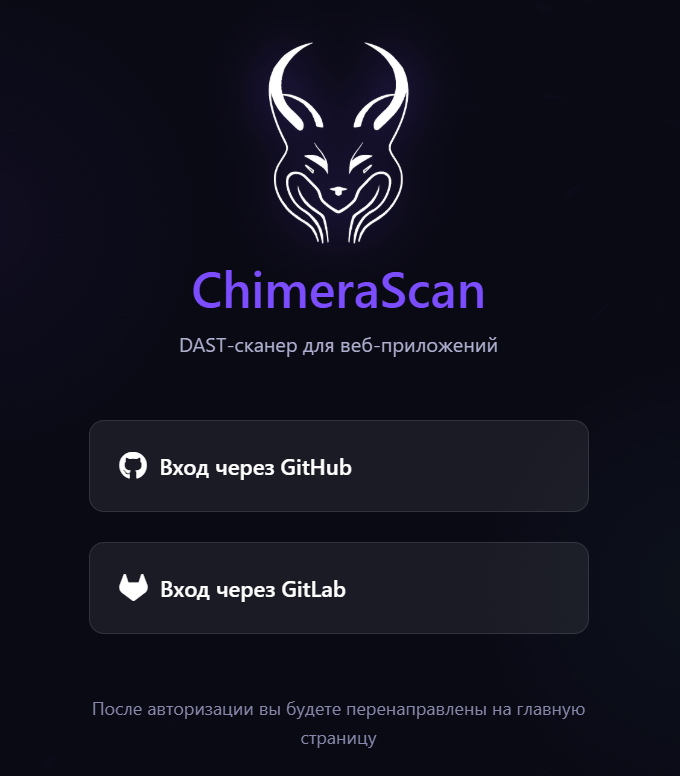
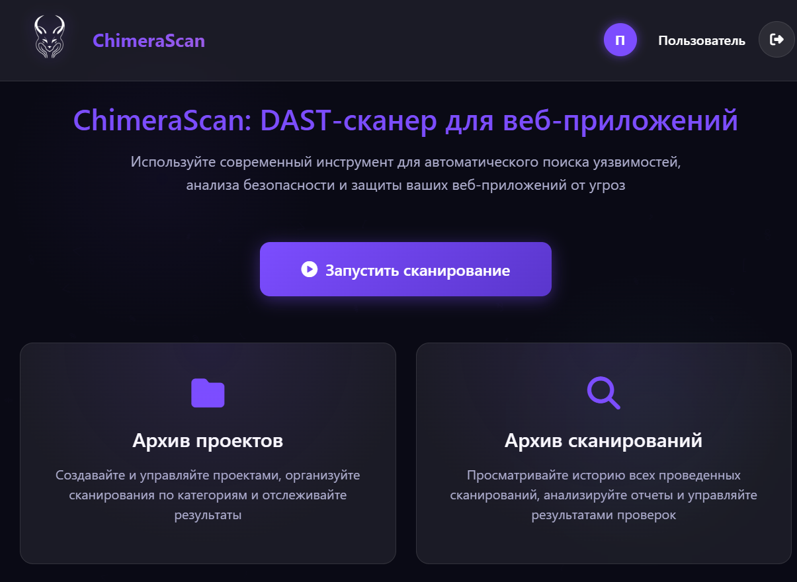
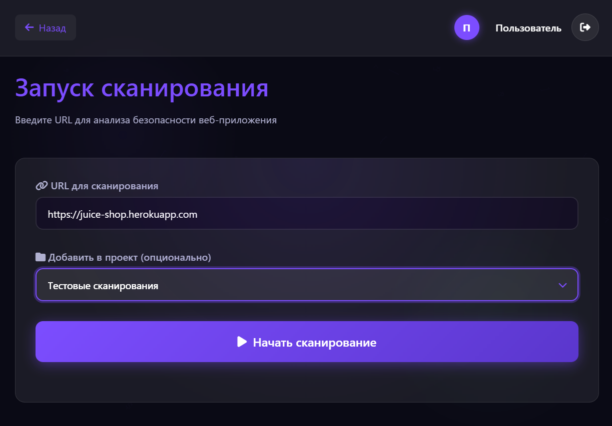
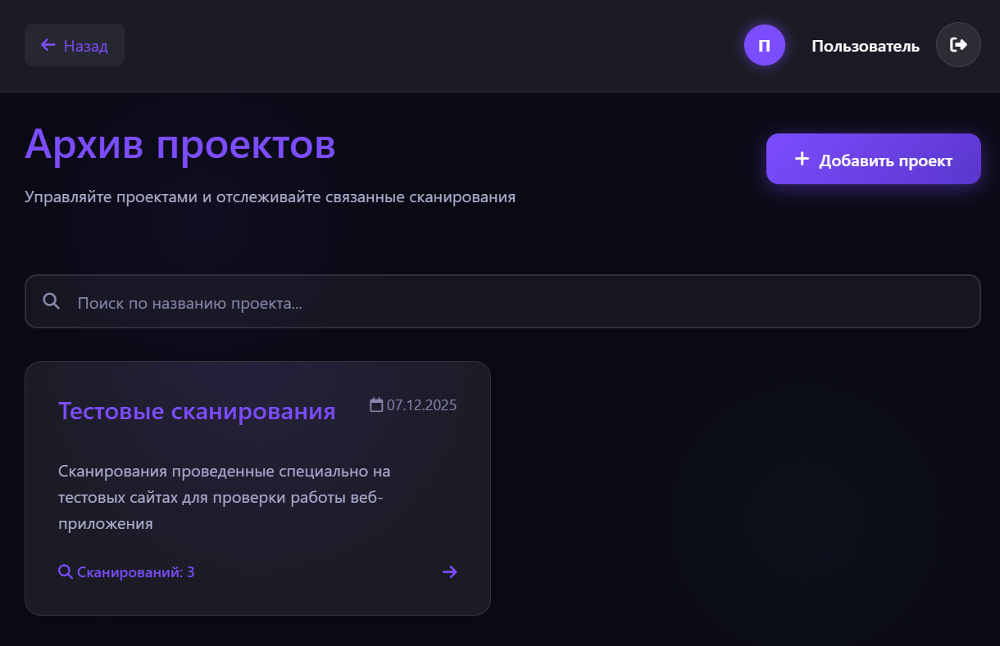
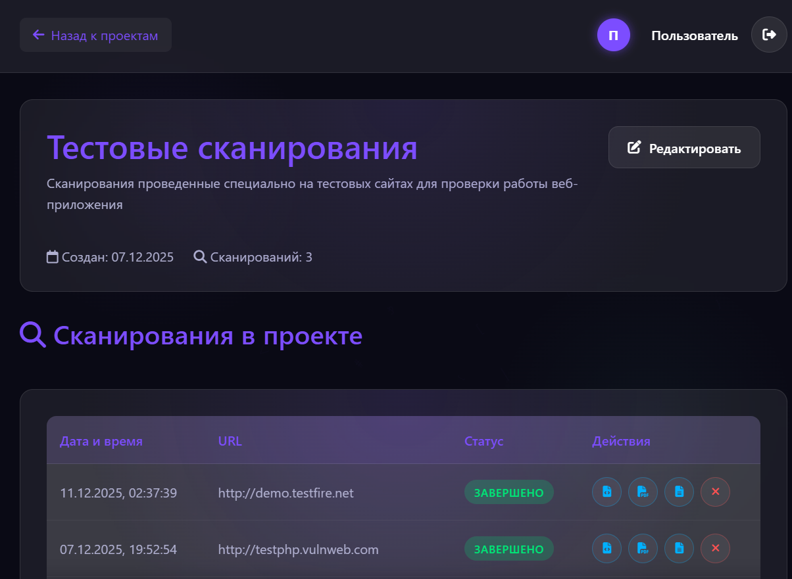
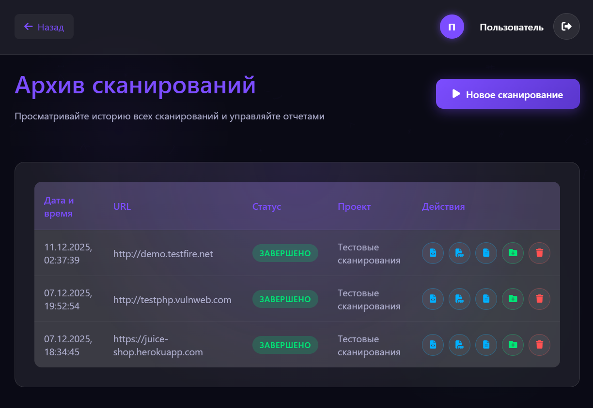
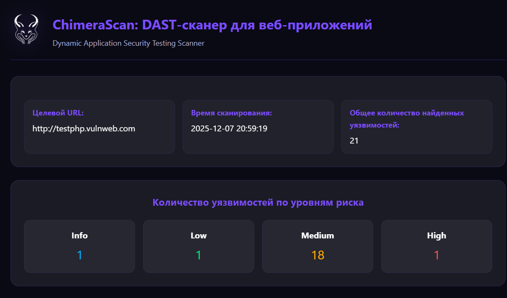
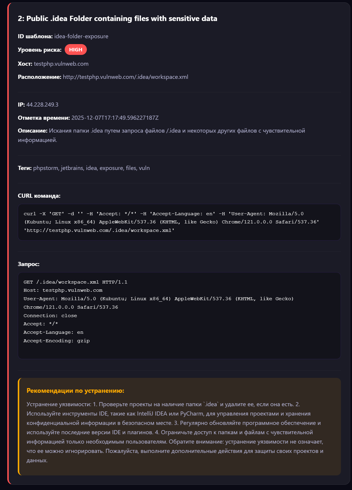

# ChimeraScan - DAST сканер для веб-приложений

**ChimeraScan** - это система динамического анализа безопасности веб-приложений (DAST) с поддержкой AI-анализа уязвимостей, интеграцией OAuth и генерацией отчетов.

## Основные возможности

- **Сканирование уязвимостей** с использованием Nuclei
- **AI-анализ** уровня риска через Ollama
- **Авторизация** через GitHub и GitLab OAuth
- **Управление проектами** для группировки сканирований
- **Генерация отчетов** в форматах JSON, PDF и HTML
- **Русский интерфейс** и локализация результатов

## Технологический стек

- **Бэкенд**: Go (Gin Framework)
- **База данных**: PostgreSQL
- **Сканер**: Nuclei (через Docker)
- **AI-модель**: Ollama с Llama3:8b
- **Аутентификация**: OAuth 2.0 (GitHub/GitLab)
- **Отчеты**: PDF (gofpdf), HTML, JSON

## 🚀 Быстрый старт

Для развертывания и запуска приложения следуйте инструкциям в [SETUP.md](./SETUP.md)

## 🔧 Конфигурация

1. Скопируйте `.env.example` в `.env`
2. Заполните все необходимые переменные окружения
3. Настройте OAuth приложения в GitHub/GitLab

## Функциональность API

- **Проекты**: Создание, просмотр, обновление, удаление
- **Сканирования**: Запуск, остановка, просмотр статуса
- **Отчеты**: Генерация и скачивание в разных форматах
- **Уязвимости**: Детальный просмотр с AI-анализом

## Безопасность

- Валидация URL перед сканированием
- Защита от сканирования локальных хостов
- OAuth аутентификация
- CSRF защита через state параметры

## Интеграция с AI

Приложение использует Ollama с моделью Llama3:8b для:
- Определения уровня риска уязвимостей
- Генерации рекомендаций по исправлению
- Перевода описаний на русский язык

## Интерфейс пользователя

### Вход в систему
Минималистичная, центрированная страница фокусирует внимание пользователя на выборе способа входа. Отсутствие лишних элементов помогает быстро приступить к работе. Элементы страницы включают крупный логотип и название продукта ChimeraScan, краткий слоган, поясняющий суть веб-приложения, две крупные кнопки для входа через GitHub и GitLab с узнаваемыми иконками, а также поясняющий текст мелким шрифтом о процессе перенаправления.

### Главная панель
Эта страница служит центром управления, предоставляя быстрый доступ ко всем основным функциям и обзор текущего состояния, таким как последние проекты и активные сканирования. Основные элементы включают фиксированную шапку страницы с логотипом и кнопкой «Выйти», основную секцию с крупным заголовком, кратким описанием возможностей и доминирующей кнопкой «Запустить сканирование», а также блок быстрых действий с двумя крупными карточками-виджетами: «Архив проектов» и «Архив сканирований», предназначенными для быстрой навигации к истории.

### Страница запуска сканирования
Дизайн этой страницы сфокусирован на одном действии, очищен от всего, что не связано с вводом цели и запуском проверки. Динамическая смена состояний происходит на одной странице для обеспечения непрерывности опыта пользователя.

**Состояние формы ввода** включает большое, хорошо заметное поле для ввода URL, выпадающий список для выбора проекта (опционально) и крупную акцентную кнопку «Начать сканирование».

**Состояние выполнения** скрывает форму и отображает анимированную пульсирующую сферу в центре, текстовый статус сканирования и кнопку «Остановить».

**Состояние завершения** появляется после успешного сканирования: блок с результатами, заголовок «Сканирование завершено!», кнопки для экспорта отчёта в форматах JSON, PDF, HTML и кнопка «Новое сканирование».

**Состояние отмены** активируется при остановке пользователем: неподвижная сфера, заголовок «Сканирование отменено» с иконкой предупреждения и кнопка «Новое сканирование».

**Состояние ошибки** возникает при сбое: иконка ошибки, заголовок «Ошибка сканирования», детализированное сообщение об ошибке и кнопка «Попробовать снова».

### Архив проектов
Данная страница предоставляет централизованный обзор всех созданных пользователем проектов, позволяя быстро находить, открывать и управлять группами сканирований. Основные элементы включают фиксированную шапку с кнопками «Назад» и «Выйти», заголовок раздела «Архив проектов» с поясняющим подзаголовком, панель действий с кнопкой «Добавить проект», строку поиска для фильтрации проектов по названию и сетку карточек проектов, отсортированных по дате создания. Каждая карточка отображает название, дату создания, количество сканирований и стрелку для перехода к деталям.

### Конкретный проект
Страница представляет детальный вид выбранного проекта со списком всех связанных сканирований. На ней расположены стандартная шапка с кнопкой «Назад к проектам», блок сведений о проекте в виде карточки с названием, описанием, датой создания, количеством сканирований и кнопкой «Редактировать», а также раздел «Сканирования в проекте» с таблицей всех связанных сканирований. Таблица содержит колонки: Дата и время, Целевой URL, Статус (цветной бейдж), Действия (иконки для скачивания отчётов в форматах JSON, PDF, HTML и кнопка для удаления сканирования из проекта). В нижней части страницы находится кнопка «Удалить проект».

### Архив сканирований
Единая таблица на этой странице позволяет просматривать всю историю сканирований пользователя с расширенными возможностями управления. Элементы страницы включают стандартную шапку с кнопкой «Назад», заголовок раздела «Архив сканирований» с поясняющим подзаголовком, панель действий с кнопкой «Новое сканирование» для быстрого запуска и основную таблицу. В таблице представлены колонки: Дата и время, Целевой URL, Статус (цветной бейдж), Привязанный проект (название или «-»), Действия. В колонке «Действия» представлен полный набор иконок: скачивание отчёта (JSON, PDF, HTML), добавление/изменение проекта (открывает модальное окно), удаление сканирования.

### HTML-отчёт с уязвимостью
Детализированное представление результатов сканирования формируется бекендом автоматически. Основные элементы отчёта включают шапку с логотипом, заголовком «ChimeraScan: DAST-сканер для веб-приложений», целевым URL, временем сканирования и общим количеством найденных уязвимостей, а также блок статистики с визуализацией количества уязвимостей по уровням риска: Info, Low, Medium, High.

Каждая найденная уязвимость представлена в виде детализированной карточки. Карточка содержит заголовок с названием уязвимости и её порядковым номером, информационную панель с данными ID шаблона, уровень риска AI (бейдж), хост, расположение, IP-адрес, отметка времени, текстовое описание уязвимости, список внешних ссылок на источники (CVE, статьи), ключевые теги, классификацию по CVE и CWE идентификаторам (если есть), готовую CURL команду для воспроизведения, технические детали HTTP-запроса, а также рекомендации по устранению, сгенерированные моделью phi:2.7b на русском языке.

## Благодарности

- [Nuclei](https://github.com/projectdiscovery/nuclei) за ядро сканера
- [Ollama](https://ollama.ai) за AI интеграцию
- [Gin Framework](https://github.com/gin-gonic/gin) за веб-фреймворк