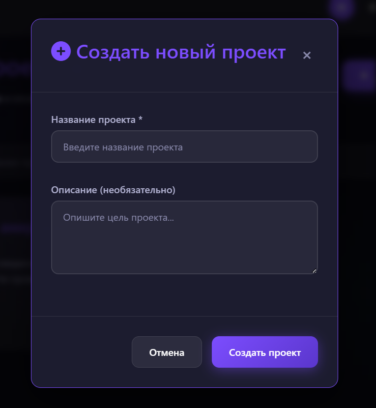
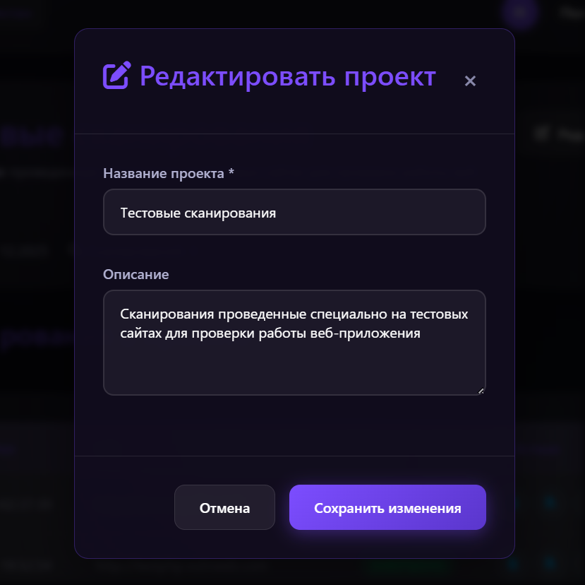

  
  <h1 style="display: inline-block; vertical-align: middle; margin: 0;">ChimeraScan - DAST сканер для веб-приложений</h1>

**ChimeraScan** - это система динамического анализа безопасности веб-приложений (DAST) с поддержкой AI-анализа уязвимостей, интеграцией OAuth и генерацией отчетов.

## Основные возможности

- **Сканирование уязвимостей** с использованием Nuclei
- **AI-анализ** уровня риска через Ollama
- **Авторизация** через GitHub и GitLab OAuth
- **Управление проектами** для группировки сканирований
- **Генерация отчетов** в форматах JSON, PDF и HTML
- **Русский интерфейс** и HTML отчет

## Технологический стек

- **Бэкенд**: Go (Gin Framework)
- **База данных**: PostgreSQL
- **Сканер**: Nuclei (через Docker)
- **AI-модель**: Ollama с phi:2.7b
- **Аутентификация**: OAuth 2.0 (GitHub/GitLab)
- **Отчеты**: PDF (gofpdf), HTML, JSON

## Быстрый старт

Для развертывания и запуска приложения следуйте инструкциям в [SETUP.md](./SETUP.md)

## Интерфейс пользователя

### Вход в систему
Минималистичный, центрированный интерфейс с кнопками для входа через GitHub или GitLab.

### Главная панель
Центр управления приложением с быстрым доступом ко всем функциям: запуску сканирований, архиву проектов и истории проверок.

### Страница запуска сканирования
Интерфейс, сфокусированный на одной задаче. Включает форму ввода цели и динамическую смену состояний (выполнение, завершение, ошибка, отмена).

### Архив проектов
Обзор всех проектов пользователя. Содержит панель для создания новых проектов через модальное окно и поиск для фильтрации.

Для добавления нового проекта необходимо нажать на соответствующую кнопку в панели действий, после чего откроется модальное окно с формой для ввода названия и описания.

### Конкретный проект
Детальный вид проекта со списком связанных сканирований. Позволяет редактировать информацию о проекте и управлять сканированиями.

Для изменения данных проекта следует воспользоваться кнопкой «Редактировать» в карточке сведений, что откроет форму редактирования.

### Архив сканирований
Таблица со всей историей сканирований. Для каждой записи доступны действия: скачивание отчетов, привязка к проекту и удаление.

### HTML-отчёт с уязвимостью
Автоматически генерируемый отчет. Содержит сводную статистику и детализированные карточки для каждой найденной уязвимости с рекомендациями AI.

## Благодарности

- [Nuclei](https://github.com/projectdiscovery/nuclei) за ядро сканера
- [Ollama](https://ollama.ai) за AI интеграцию
- [Gin Framework](https://github.com/gin-gonic/gin) за веб-фреймворк
